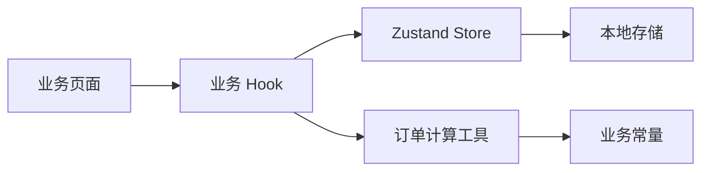

# 系统架构

## 概述

充电桩订单管理 V3 是一个基于 React、TypeScript 与 Vite 的前端应用。订单、库存、设置等业务数据通过 Zustand Store 管理，并由本地存储层持久化。

应用以 `features` 目录组织业务能力。共享的类型、常量、计算工具和存储适配位于顶层 `types`、`constants` 与 `shared` 目录，避免页面之间直接复制业务规则。

## 技术栈

- TypeScript
- React 18
- React Router 6
- Zustand 4
- Vite 5
- Tailwind CSS 与模块化 CSS
- PWA Service Worker

## 目录结构

```text
src/
├── constants/          业务词表、物料与财务常量
├── features/           订单、解析、物料、统计、财务、设置模块
├── lib/                解析引擎与兼容逻辑
├── routes/             懒加载路由
├── shared/             共享组件、Hooks、存储与工具函数
├── stores/             Zustand 状态模块
└── types/              领域实体和公共类型
```

## 主要模块

### 订单模块

位置：`src/features/order/`

订单模块处理预约、勘测、材料选择、完工确认和话术生成。`useCompletion` 在订单完成时保存实际安装日期、材料成本、平台扣点、服务费和实际利润快照。

### 财务与统计模块

位置：`src/features/finance/`、`src/features/statistics/`

两个模块通过 `src/shared/utils/orderCalc.ts` 中的业务日期和财务快照函数保持相同口径。业务月份优先取实际安装日期，再依次回退到预约日期、完成日期和创建日期。

### 物料模块

位置：`src/features/material/`、`src/constants/`

物料数据按批次静态维护，并由 `src/constants/materialData.ts` 聚合。单个批次文件保留稳定导出，内部通过分片数组维持单文件行数限制。

### 批量解析模块

位置：`src/features/batchParser/`、`src/lib/`

批量解析将文本转换为订单字段，平台、品牌和功率显示通过 `src/constants/platforms.ts`、`brands.ts` 和 `power.ts` 统一规范化。

## 数据流



## 关键约定

- 新业务代码按 `src/features/<domain>/` 组织。
- 金额计算复用 `orderCalc.ts`，避免页面层重复公式。
- 订单显示复用平台、品牌和功率标签函数。
- 业务源码文件控制在 400 行以内。
