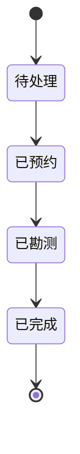

# 订单

订单表示一次充电桩安装、维修或勘测业务。它将客户信息、平台来源、预约、勘测材料和完工财务结果集中到一个实体中。

## 代码位置

| 方面 | 位置 |
|---|---|
| 实体类型 | `src/types/order.ts` |
| 状态管理 | `src/stores/orderStore.ts` |
| 完工计算 | `src/features/order/hooks/useCompletion.ts` |
| 业务日期 | `src/shared/utils/orderCalc.ts` |

## 生命周期

## 财务快照

订单完成时会保存客户应收、服务费、材料成本、平台扣点和实际利润。财务与统计模块读取这些字段，使后续设置变更不会改写历史订单结果。

## 业务日期

月度归集优先使用 `actualInstallDate`，其后依次使用 `appointmentDate`、`completeDate` 与 `createdAt`。该规则用于统计筛选、财务对账和 CSV 导出。
